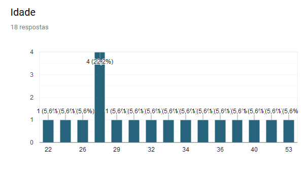
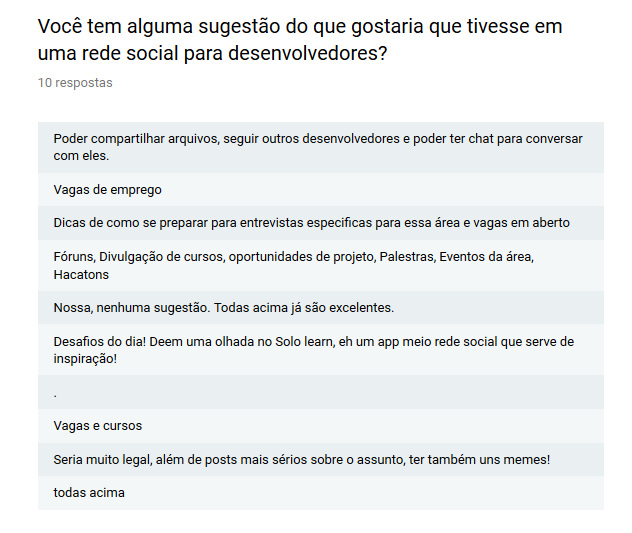

# Rede Social Dev Life
---
### Objetivo

 Dev Life é uma rede social direcionada para programadores profissionais, estudantes e entusiastas, com objetivo de facilitar o compartilhamento e acesso à informações da área de tecnologia, onde o usuário possa criar um perfil e interagir com outros usuários através de posts, curtidas, comentários e chat. As necessidades dos potenciais usuários foram apontadas por uma pesquisa com estudantes de tecnologia.  

---
### Como funciona:

Para ter aceso as funcionalidades do produto é necessário realizar um cadastro, que pode ser realizado tanto inserindo um e-mail válido e definindo uma senha, como também fazendo uma autenticação pelo GitHub ou Google.
Depois de logado o usuário pode configurar seu perfil, fazer e responder perguntas pertinentes a área, postar conteúdo sobre tecnologia (links, vídeos, materiais), compartilhar e curtir perguntas, posts e respostas. O usuário também pode editar e excluir as mensagens que ele mesmo postar.

---

### Personas:

### Pesquisa:

## roadmap oficial do projeto

#### versão 3.0.0 (outubro/2019)

Funcionalidades:
- comentar e compartilhar posts de amigos

#### versão 2.0.0 (previsão agosto/2019)

Funcionalidades:
- Adicionar informações pessoais na página de perfil
- chat

#### versão 1.1.0 (em desenvolvimento)

Funcionalidades:
- Regristro de conta com nome, email e senha;
- Filtro por privacidade (público e privado).

#### versão 1.0.0

Funcionalidades implementadas:
- Regristro de conta com email e senha ou com Google ou GitHub;
- Login com email e senha ou com Google ou GitHub;
- Visualizar o feed com o nome do usuário para saber se está logado (em qual conta); 
- Publicar posts sem número de caracteres definidos; 
- Escolher a privacidade do post (público ou privado)
- Editar post;
- Apagar post que postou;
- Dar likes; 
- Vizualizar os like dados;
- Fechar e abrir o navegador e ter a autenticação persistente;
- Deslogar da rede.
- App: https://rede-social-3220b.firebaseapp.com/

A validação dos dados no momento do registro garante que o os dados cadastrados correspondam aos quesitos de formatação e a senha está oculta. 

Foi utilizado o Firebase para autenticação, banco de dados e armazenamento. 
Usamos HTML5, CSS3, Bootstrap 4, JavaScript e Jquery para o desenvolvimento.
